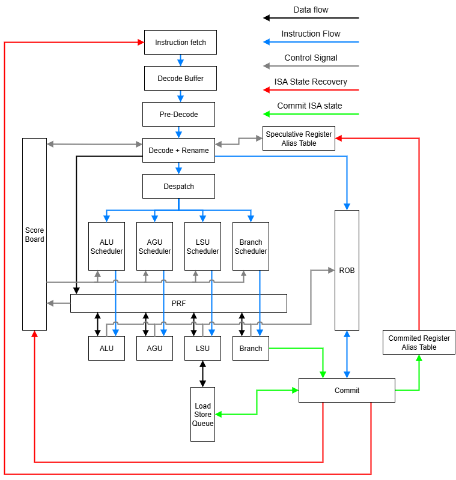

# seepeeyou
## Goals
The goal of this project is to explore modern CPU SOC design with an emphasis on the core and memory subsystem design.

To this end the following points are of focus for learning:
- Fully coherent multi level cache
- OOO execution
- High frequency optimisations
- Area optimisations
- Network On Chip physical design
- Network on chip protocol design
- ISA register definitions
- ISA instruction definitions
- OOB telemetry & RAS

## Architecture
The core components of the SOC are the memory controller, which handles interfacing with external memory chips that I made up for now, and the Network on chip, which handles core to IMC comms and supports multicast for eventual multi core design, and finally the core, which does all the processing things.

### Core architecture
The core is called Rosies Out of Order Core, It is supposed to be a simple core to extract ILP out of ALU operations.

I need to update diagram with L1 & L2 caches & NIU.

## What does it do?
Currently its a very simple in order CPU core with some L1 & L2 cache with a 3 stage pipeline: fetch, decode, execute (execute and write back are bundelled). Attached to this core is a very simple network on chip designed to make adding extra IP like HSIO or USB or something easier in the future once I get round to it, the SOC also houses a mock memory controller and the test bench has some mock RAM that is used to emulate RAM with its own memory clock domain and the NOC has its own Fclk clock domain seperate from core clock domain. CPU also processes variable length instructions.

If you want to know more I have a much more detailed document detailing full(ish) ISA spec and CPU design spec that I can hand out but I dont want to post it here as its a cloud saved word doc.

## Why do I do this to myself?
This project is a vehicle for me to learn the entire process from architecture design through to GDSII, as such its a bit messy in places and might not make a lot of sense but hopefully it shows me learning as I go along :)

## Who am I?
I have a background in low level programming in C/C++ with some GPU programming with SYCL and a bit of python mixed in for some AI/ML stuff I have worked on in the past, I **really** like designing fast software to do things (usually random thoughts that come to me). A while ago I got the itch to learn how to design the hardware that my software runs on so decided to attempt to learn SV and the full process of idea -> silicon for a CPU.